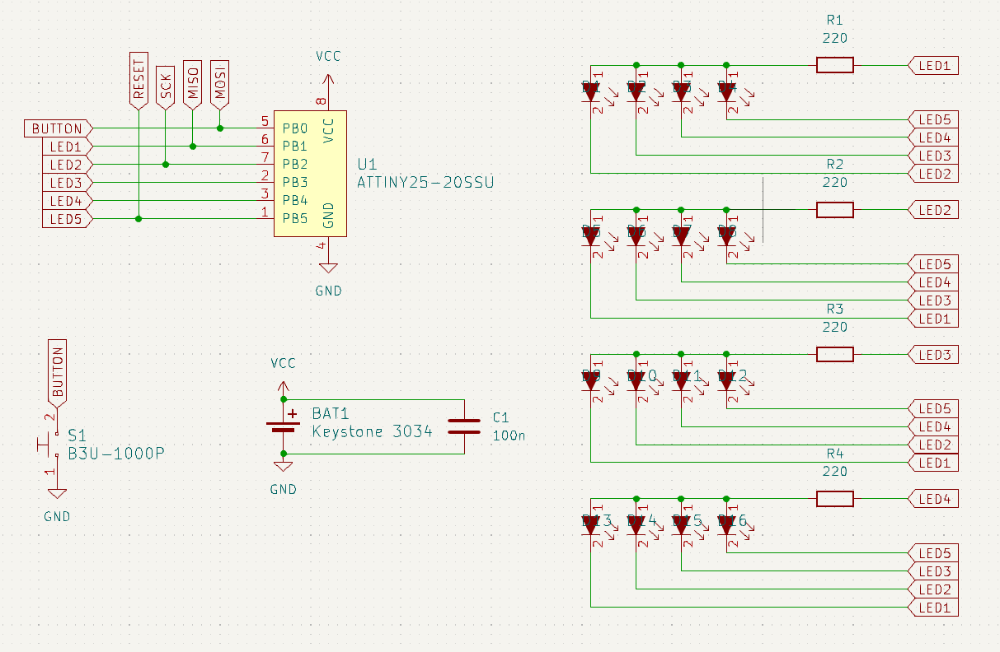

# Keychain Tiny Game

  

# Features
- Beautiful state of the art 1D graphics
- One button gameplay
- Can hold keys
- No microtransactions

# The idea
I recently bought a novelty keychain: it's a handmade leather pouch designed to protect my phone screen from scratches while adding a touch of style. Unfortunately, it’s more of a hindrance than a help, making it difficult to use my keys and turning me into a bumbling character from a horror movie that can't open the door to safety. That truth is that keys are naturally scratchy, and they seem to resent being kept away from their preferred surfaces. 

This keychain isn’t just a time-wasting game for dentist appointments, it’s also a collection of 24 tiny, sharp SMD components waiting to sand down my phone screen the first time I accidentally put it in the wrong pocket.

# Gameplay
Press the button when the spinning light reaches the target. Do it again slightly faster. Repeat until it's your turn at the dentist, doctor, barber, etc...

# Hardware
The board utilizes an ATtiny25 microcontroller running at 1MHz to drive 16 LEDs via [Charlieplexing](https://en.wikipedia.org/wiki/Charlieplexing). A single button on the back of the board allows for game control. The device is powered by a single CR2032 coin cell battery.

  

